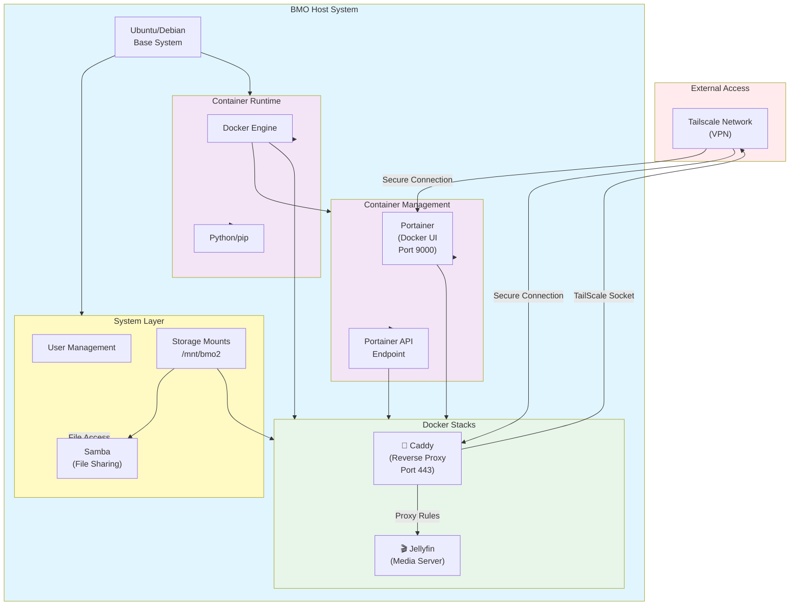

# BMO Homelab Architecture

## System Overview

## Component Details

| Component | Role | Purpose |
|-----------|------|---------|
| **System** | Base OS & Services | Ubuntu/Debian with user management, storage mounts, and file sharing via Samba |
| **Docker** | Container Runtime | Containerizes applications and services |
| **Portainer** | Container Management UI | Web-based Docker management (Port 9000) |
| **Caddy** | Reverse Proxy | HTTPS reverse proxy for routing traffic to services (Port 443) |
| **Jellyfin** | Media Server | Media library and streaming service |
| **Tailscale** | Networking | Secure VPN access to services outside the local network |
| **Storage** | External Drives | 2TB external storage mounted for media and application data |
| **Samba** | File Sharing | Network file sharing for accessing storage remotely |

## Access Paths

- **Local Management**: SSH to host → Portainer UI (http://bmo.cassowary-harmonic.ts.net:9000)
- **Remote Services**: Tailscale VPN → Caddy reverse proxy (https://bmo.cassowary-harmonic.ts.net) → Jellyfin & other services
- **File Access**: Samba shares accessible from network
- **Direct Container Access**: Portainer API for automated stack deployment

## Deployment Strategy

All services are deployed as Docker Compose stacks through Portainer, enabling:
- Easy service management and updates
- Persistent configuration and data storage
- Network isolation between containers
- Automated backup and restoration capabilities
