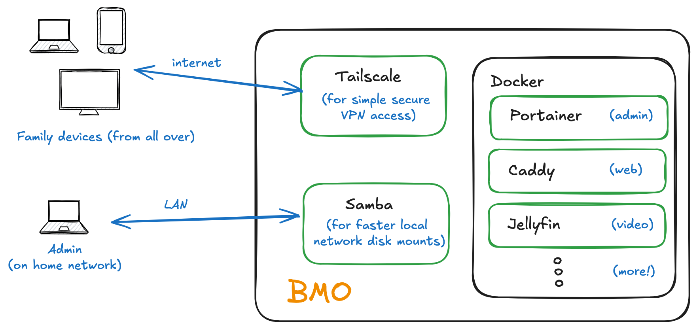

# bmo


Ansible playbook to setup my homelab server named "bmo"

Main use of this homelab is to provide a simple way to serve & share
family photo, music, and movie files in an easily browsable way.

It is my second try setting one of these up after prototyping a setup
on a raspberry pi, which worked pretty well, but was a bit unstable
and underpowered. So I picked up a reconditioned Lenovo ThinkCentre
which should provide a bit more power, plus some GPU capabilities.

I decided to capture the setup in code in case I needed to move
machines again, and to provide a backup in case I severely misconfigure
the machine. Ansible seems a good choice as it works over SSH
and there are quite a lot of open-source roles available for
the components I'm likely to use.

# design

Since its likely I'll be trying a number of homelab services
I'm trying to run as much as possible as Docker containers.

I also decided to try out running Portainer instead of docker-compose. It is a little less straightforward to configure, but the management console is handy. We'll see how it goes.



So services running natively include:
- Docker
- Tailscale - to provide VPN access from multiple (family) locations
- Samba - to provide disk mounts to make media, image, and audio file uploading & maintenance easier

Services running as Docker containers include (so far):
- Portainer - container management
- Caddy - simple web server
- Jellyfin - video library

I expect to be adding additional containers (or stacks) for photo library and audio file sharing.

# installation

I tried to make installation possible starting with a host with
- Debian fresh install
- ssh enabled
- user login
- user password
- root password

## First step: install essential packages and setup the sudo user

Use ansible-vault to encrypt the `ansible_user_password`.

```
ansible-vault edit ./group_vars/all/vault.yml
```

In general you can use [./group_vars/all/vault.yml.txt](./group_vars/all/vault.yml.txt)
as a guide to what kind of secrets will be required. But for this first step we should
just need `ansible_user_passowrd`.

Now run the essential & user tagged tasks in the playbook, providing the vault password
and the root password when prompted. The vault password should be cached in your ~/.vault_pass.txt 
and the root password will be used to setup sudo for the `ansible_user`...

_TODO: hmm, forgot I'd added ansible_user (me) to ./inventory file. as well as ssh private key file path. I need to revisit the barebones beginning again as I'm leaving stuff out._

```
	ansible-playbook playbook.yml -i inventory --ask-become-pass --ask-vault-pass --become-method=su --tags "essential,user"
```

## 2. Setup your Tailscale account and get an auth key

I want to make this machine available to my family, but I'm lazy, and we're moving house,
so I don't want to spend the time needed to safely maintain a public endpoint.

The solution is to use Tailscale. I considered using Wireguard, but Tailscale offers
a wide variety of clients that make it easier for family devices (phones, computers, TV's)
to connect.

_TODO: Tailscale setup checklist and auth key generation details_

## 3. Pick passwords and mount points

_TODO: Document password & mount point (samba) setup

## 4. Download shared roles and collections from Ansible Galaxy

Where possible, I've used widely shared roles and collections which
are listed in [./requirements.yml](./requirements.yml). These
need to be downloaded once and they'll be cached in ... _(TODO: where? where, Dave?)_

```
ansible-galaxy collection install -r requirements.yml
```

## 4. Run the playbook

With everything in place, we should be good to run the playbook and get this homelab on the air!
```
ansible-playbook playbook.yml -i inventory
```
